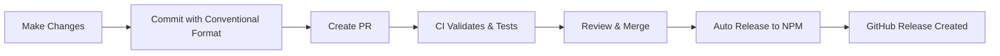

# GitHub Actions & CI/CD

This directory contains the complete CI/CD configuration for automated releases, testing, and dependency management.

## 📁 Directory Structure

```
.github/
├── workflows/
│   ├── release.yml              # Automated releases (main workflow)
│   ├── ci.yml                   # Build, test, lint
│   ├── pr-validation.yml        # PR title & commit validation
│   └── dependency-update.yml    # Weekly dependency updates
├── RELEASE_STRATEGY.md          # Complete release documentation
├── CONTRIBUTING.md              # Contribution guidelines
├── NPM_SETUP.md                 # NPM token setup guide
├── QUICK_START.md               # 10-minute setup guide
├── PULL_REQUEST_TEMPLATE.md     # PR template
└── commitlint.config.js         # Commit message validation
```

## 🚀 Quick Links

### Getting Started
- **[Quick Start Guide](./QUICK_START.md)** - Set up CI/CD in 10 minutes
- **[NPM Setup](./NPM_SETUP.md)** - Configure NPM authentication

### For Contributors
- **[Contributing Guide](./CONTRIBUTING.md)** - How to contribute
- **[Release Strategy](./RELEASE_STRATEGY.md)** - How releases work

### For Maintainers
- **[NPM Setup](./NPM_SETUP.md)** - Token management
- **[Release Strategy](./RELEASE_STRATEGY.md)** - Release process details

## 🔄 Workflows Overview

### 1. Release Workflow (`release.yml`)
**Trigger**: Push to `main` or manual dispatch

**What it does**:
- ✅ Detects which packages changed
- ✅ Analyzes commits for version bump (semver)
- ✅ Builds packages
- ✅ Publishes to NPM
- ✅ Creates GitHub releases
- ✅ Tags repository

**Result**: Automatic releases based on conventional commits

### 2. CI Workflow (`ci.yml`)
**Trigger**: Pull requests and pushes to `main`

**What it does**:
- ✅ Validates commit messages
- ✅ Builds both packages
- ✅ Runs TypeScript type checking
- ✅ Uploads build artifacts

**Result**: Ensures code quality before merge

### 3. PR Validation (`pr-validation.yml`)
**Trigger**: PR opened/updated

**What it does**:
- ✅ Validates PR title (conventional format)
- ✅ Checks PR size
- ✅ Detects affected packages
- ✅ Previews release impact
- ✅ Comments with release information

**Result**: Better PR quality and release predictability

### 4. Dependency Updates (`dependency-update.yml`)
**Trigger**: Weekly schedule (Mondays) or manual

**What it does**:
- ✅ Checks for outdated dependencies
- ✅ Updates non-breaking versions
- ✅ Tests builds
- ✅ Creates PRs for successful updates
- ✅ Creates issues for failed updates
- ✅ Runs security audits

**Result**: Automatic dependency maintenance

## 🎯 How It Works

### Normal Development Flow



### Example Workflow

```bash
# 1. Create branch
git checkout -b feat/new-feature

# 2. Make changes
# Edit packages/MuiMultiDateRangePicker/lib/...

# 3. Commit (conventional format)
git commit -m "feat(free): add custom date formatter"

# 4. Create PR
gh pr create --title "feat(free): Add custom date formatter"

# 5. CI runs automatically
# - Validates commit format ✓
# - Builds packages ✓
# - Runs type checks ✓
# - Comments with release preview ✓

# 6. Merge PR
gh pr merge

# 7. Release workflow runs automatically
# - Detects changes in free package ✓
# - Calculates version: 0.1.0 → 0.2.0 ✓
# - Builds package ✓
# - Publishes to NPM ✓
# - Creates GitHub release ✓
# - Tags: @spacedevin/react-mui-multi-range-picker@0.2.0 ✓
```

## 📝 Commit Message Format

This project uses [Conventional Commits](https://www.conventionalcommits.org/) for automated versioning.

### Format
```
<type>(<scope>): <subject>

[optional body]

[optional footer]
```

### Types & Version Bumps

| Commit | Version Change | Example |
|--------|----------------|---------|
| `fix:` | Patch (0.0.x) | `fix(picker): prevent duplicate ranges` |
| `feat:` | Minor (0.x.0) | `feat(free): add custom formatter` |
| `feat!:` | Major (x.0.0) | `feat(picker)!: redesign API` |

### Scopes
- `free` - Free package
- `pro` - Pro package  
- `picker` - Both packages
- `deps` - Dependencies
- `build` - Build system
- `ci` - CI/CD

## 🔐 Required Secrets

### NPM_TOKEN
- **Type**: NPM Automation Token
- **Required**: Yes
- **Setup**: See [NPM Setup Guide](./NPM_SETUP.md)
- **Used for**: Publishing to NPM

### GITHUB_TOKEN
- **Type**: Auto-provided by GitHub
- **Required**: Automatic
- **Used for**: Creating releases, pushing tags

## 🎓 Documentation

### For Everyone
- **[Quick Start](./QUICK_START.md)** - Get started in 10 minutes
- **[Release Strategy](./RELEASE_STRATEGY.md)** - How releases work

### For Contributors
- **[Contributing](./CONTRIBUTING.md)** - Contribution guidelines
- **[PR Template](./PULL_REQUEST_TEMPLATE.md)** - PR format

### For Maintainers
- **[NPM Setup](./NPM_SETUP.md)** - Token management
- **[Release Strategy](./RELEASE_STRATEGY.md)** - Advanced configuration

## 🐛 Troubleshooting

### Common Issues

| Problem | Solution |
|---------|----------|
| Release not triggered | Check commit format, verify changes in `packages/` |
| NPM publish fails | Verify NPM_TOKEN, check token permissions |
| Build fails | Test locally with `npm run build` |
| Commit rejected | Follow conventional commit format |

### Getting Help

1. Check relevant documentation (links above)
2. Review GitHub Actions logs
3. Test locally
4. Open an issue with `ci/cd` label

## 📊 Monitoring

### GitHub Actions
- Go to **Actions** tab to see workflow runs
- Click on any workflow for detailed logs
- Failed workflows show red ❌
- Successful workflows show green ✅

### NPM Packages
- Free: https://www.npmjs.com/package/@spacedevin/react-mui-multi-range-picker
- Pro: https://www.npmjs.com/package/@spacedevin/react-mui-pro-multi-range-picker

### GitHub Releases
- Go to **Releases** page for all published versions
- Each release includes changelog and installation instructions

## 🔄 Maintenance

### Token Rotation
Rotate NPM tokens every 6-12 months:
1. Create new token on NPM
2. Update `NPM_TOKEN` secret on GitHub
3. Revoke old token on NPM

### Workflow Updates
- Workflows are in `workflows/` directory
- Edit carefully and test with manual dispatch
- Review GitHub Actions documentation for syntax

### Dependency Updates
- Automated via `dependency-update.yml`
- Runs weekly on Mondays
- Creates PRs automatically
- Review and merge if builds pass

## ✅ Best Practices

1. **Always use conventional commits** - Required for automated releases
2. **Test locally before pushing** - Run `npm run build`
3. **Keep PRs focused** - One feature/fix per PR
4. **Review CI checks** - Don't merge if CI fails
5. **Monitor releases** - Check GitHub Actions and NPM

## 🔗 External Resources

- [Conventional Commits](https://www.conventionalcommits.org/)
- [Semantic Versioning](https://semver.org/)
- [GitHub Actions Docs](https://docs.github.com/en/actions)
- [NPM Publishing](https://docs.npmjs.com/cli/v10/commands/npm-publish)

---

**Questions?** Check the documentation links above or open an issue.

