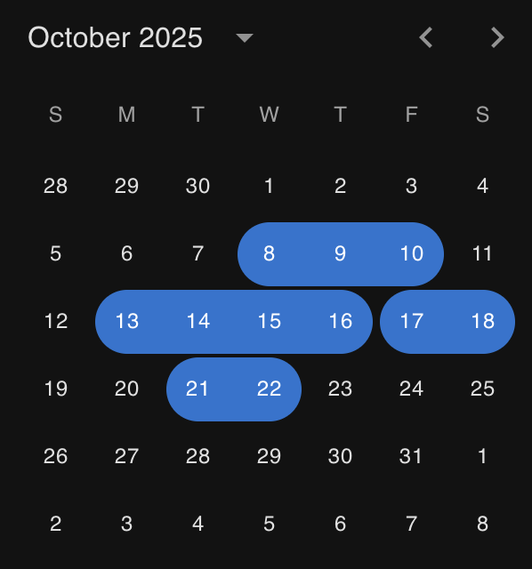
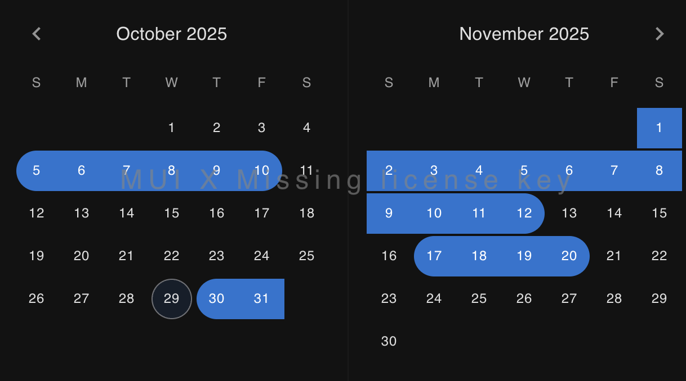

# MUI Multi-Range Date Picker


A monorepo containing React date picker components that allow selecting multiple non-contiguous date ranges with click-and-drag support. Built on top of Material-UI's date picker components with full theme integration.

<p align="center">
  
  

</p>

## 📦 Packages

### [MuiMultiDateRangePicker](./packages/MuiMultiDateRangePicker)

[](https://www.npmjs.com/package/@spacedevin/react-mui-multi-range-picker)
[](https://www.npmjs.com/package/@spacedevin/react-mui-multi-range-picker)

A free multi-range date picker built on `@mui/x-date-pickers`.

**Features:**
- ✅ Multi-range selection with drag support
- ✅ Simple calendar-only interface
- ✅ No commercial license required
- ✅ Perfect for basic multi-range needs

**Links:**
- 📦 [NPM Package](https://www.npmjs.com/package/@spacedevin/react-mui-multi-range-picker)
- 📖 [Documentation](./packages/MuiMultiDateRangePicker/README.md)

### [MuiMultiDateRangePickerPro](./packages/MuiMultiDateRangePickerPro) (MUI X Pro)

[](https://www.npmjs.com/package/@spacedevin/react-mui-pro-multi-range-picker)
[](https://www.npmjs.com/package/@spacedevin/react-mui-pro-multi-range-picker)

An enhanced version built on `@mui/x-date-pickers-pro` with professional UI features.

**Features:**
- ✅ All features from the free version
- ✅ Text input field for manual date entry
- ✅ Visual chip-based range management
- ✅ Delete ranges with chip close buttons
- ⚠️ Requires MUI X Pro license for production

**Links:**
- 📦 [NPM Package](https://www.npmjs.com/package/@spacedevin/react-mui-pro-multi-range-picker)
- 📖 [Documentation](./packages/MuiMultiDateRangePickerPro/README.md)

## 🚀 Quick Start

### Installation

```bash
# Free version
npm install @spacedevin/react-mui-multi-range-picker

# Pro version (requires MUI X Pro license)
npm install @spacedevin/react-mui-pro-multi-range-picker
```

### Usage

```typescript
import React, { useState } from 'react';
import { MultiRangeDatePicker } from '@spacedevin/react-mui-multi-range-picker';
import type { DateRange } from '@spacedevin/react-mui-multi-range-picker';

function App() {
  const [ranges, setRanges] = useState<DateRange[]>([]);

  return (
    <MultiRangeDatePicker
      onChange={setRanges}
      mergeRanges={false}
    />
  );
}
```

### Running Demos Locally

```bash
# Free version demo
cd packages/MuiMultiDateRangePicker
bun install
bun run dev

# Pro version demo
cd packages/MuiMultiDateRangePickerPro
bun install
bun run dev

# Root-level demos (pull from NPM)
cd examples/esm  # Vite + ESM
bun install && bun run dev

cd examples/cjs  # Webpack + CJS
bun install && bun run dev
```

**Live Demos:** [View on GitHub Pages](https://spacedevin.github.io/mui-date-dragger/)

## 📦 Package Structure

This monorepo contains two npm packages with identical APIs:

```
mui-date-dragger/
├── packages/
│   ├── MuiMultiDateRangePicker/     # Free version
│   │   ├── lib/                      # Source code
│   │   ├── dist/                     # Built ESM + CJS + types
│   │   └── examples/demo/            # Local demo app
│   └── MuiMultiDateRangePickerPro/  # Pro version
│       ├── lib/                      # Source code
│       ├── dist/                     # Built ESM + CJS + types
│       └── examples/demo/            # Local demo app
└── examples/                         # Root-level demos
    ├── esm/                          # Vite demo (pulls from NPM)
    └── cjs/                          # Webpack demo (pulls from NPM)
```

**Package Features:**
- ✅ Tree-shakeable exports (ESM + CJS)
- ✅ Full TypeScript support with declarations
- ✅ Peer dependencies (no duplicate MUI/React)
- ✅ Zero side effects for optimal bundling
- ✅ Separate demo apps (not included in published package)

## ✨ Key Features

### Multi-Range Selection
Select multiple separate date ranges on a single calendar - perfect for vacation booking, availability calendars, or any scenario requiring non-contiguous date selection.

### Click & Drag Support
Intuitive drag-to-select interaction works seamlessly on both desktop (mouse) and mobile (touch) devices.

### Range Management
- **Add ranges**: Click/drag or use text input (Pro)
- **Remove ranges**: Drag over existing ranges or use chip close buttons (Pro)
- **Auto-merge**: Optional automatic merging of adjacent/overlapping ranges

### MUI Integration
Built as extensions of MUI's date picker components, maintaining full compatibility with:
- Theme system (light/dark mode)
- Localization
- Accessibility features
- Responsive design

## 🎯 Use Cases

- **Booking Systems**: Multi-night hotel or rental reservations
- **Availability Calendars**: Mark multiple unavailable date ranges
- **Event Planning**: Select multiple event or blackout dates
- **Project Management**: Highlight multiple milestone or sprint periods
- **Time Off Requests**: Select multiple vacation periods

## 🔧 Technology Stack

- **React** 19+ with TypeScript
- **Material-UI** 7+ (`@mui/material`)
- **MUI X Date Pickers** 8+ (`@mui/x-date-pickers`)
- **MUI X Date Pickers Pro** 8+ (`@mui/x-date-pickers-pro`) - Pro version only
- **date-fns** 4+ for date manipulation
- **Emotion** for styling

## 📋 Comparison

| Feature | Free | Pro |
|---------|------|-----|
| Multi-range selection | ✅ | ✅ |
| Drag to select | ✅ | ✅ |
| Calendar view | ✅ | ✅ |
| Theme support | ✅ | ✅ |
| Touch support | ✅ | ✅ |
| Auto-merge ranges | ✅ | ✅ |
| Text input field | ❌ | ✅ |
| Range chips UI | ❌ | ✅ |
| Click to delete chips | ❌ | ✅ |
| License required | ❌ Free | ⚠️ MUI X Pro |

## 🤝 Contributing

Contributions are welcome! Please see our [Contributing Guide](CONTRIBUTING.md) for details on:

- Development setup
- Commit conventions
- Release process
- Testing guidelines

## 📄 License

[PIF](https://payitforwardlicense.com/)
Note: Pro version requires MUI X Pro license for production use


## 🔗 Links

- [MUI Documentation](https://mui.com/)
- [MUI X Date Pickers](https://mui.com/x/react-date-pickers/)
- [MUI X Pricing](https://mui.com/x/introduction/licensing/)
